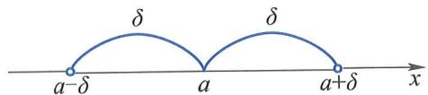

# 区间与邻域

在实数分析中，**区间**与**邻域**是描述点集结构、定义极限与连续性的基本工具。

## 一、区间（Interval）

设 $a,b \in \mathbb{R},\ a < b$：

| 类型 | 记号 | 定义 | 图示特征 |
|------|------|------|-----------|
| 开区间 | $(a,b)$ | $\{x \mid a < x < b\}$ | 端点不包含 |
| 闭区间 | $[a,b]$ | $\{x \mid a \leqslant x \leqslant b\}$ | 端点均包含 |
| 半开半闭区间 | $(a,b]$ | $\{x \mid a < x \leqslant b\}$ | 左开右闭 |
|  | $[a,b)$ | $\{x \mid a \leqslant x < b\}$ | 左闭右开 |

上述统称**有限区间**，长度为 $b-a$。

### 无限区间（Infinite Intervals）

$$
\begin{aligned}
(-\infty, +\infty) &= \{x \mid -\infty < x < +\infty\} = \mathbb{R}, \\
(a, +\infty) &= \{x \mid x > a\}, \quad [a, +\infty) = \{x \mid x \geqslant a\}, \\
(-\infty, b) &= \{x \mid x < b\}, \quad (-\infty, b] = \{x \mid x \leqslant b\}.
\end{aligned}
$$

## 二、邻域（Neighborhood）

设 $a \in \mathbb{R},\ \delta > 0$：

- **$\delta$-邻域**：  
  $$
  U(a,\delta) = \{x \mid |x - a| < \delta\} = (a-\delta,\, a+\delta).
  $$  
  其中 $a$ 为**中心**，$\delta$ 为**半径**。

- **去心 $\delta$-邻域**（punctured neighborhood）：  
  $$
  \mathring{U}(a,\delta) = \{x \mid 0 < |x - a| < \delta\} = (a-\delta,\, a+\delta) \setminus \{a\}.
  $$  
  排除中心点本身，是定义**极限**（$x \to a$ 但 $x \ne a$）的关键工具。

  
图1.1.2：点 $a$ 的 $\delta$-邻域示意

当不强调半径时，简记为 $U(a)$ 和 $\hat{U}(a)$（或 $\mathring{U}(a)$）。

关联知识点：  
- [[有界集与确界定义]]{type=concept, label=区间有界性, render=link, tags=实数理论}  
- [[极限的定义]]{type=concept, label=邻域在极限中的作用, render=card, subject=高等数学, grade=大学, tags=极限|基础}  
- [[函数的定义]]{type=concept, label=定义域常用形式, render=link, tags=函数|基础}