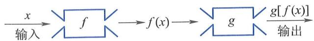
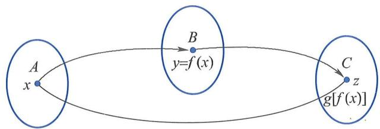

# 复合映射

设有两个映射：  
$$
f: A \to B,\quad g: B \to C.
$$  
若 $f$ 的**值域** $f(A)$ 包含于 $g$ 的**定义域** $B$（即 $f(A) \subseteq B$），则可定义它们的**复合映射**（或**映射合成**）：  
$$
g \circ f: A \to C,\quad (g \circ f)(x) = g\big(f(x)\big),\quad x \in A.
$$

> ✅ **直观理解**：将 $x$ 先经 $f$ 映为 $y = f(x) \in B$，再将 $y$ 经 $g$ 映为 $z = g(y) \in C$，形成一条“$A \xrightarrow{f} B \xrightarrow{g} C$”的链式映射路径（见图1.1.5）。

  
(a)

  
(b)  
图1.1.5：复合映射的两种示意（a：一般情形；b：值域与定义域匹配示意）

### ⚠️ 关键前提（必要条件）  
并非任意两个映射都可复合！必须满足：  
$$
\boxed{f(A) \subseteq B}
$$  
即前一个映射的输出范围，必须全部落在后一个映射的合法输入范围内。否则，对某些 $x \in A$，$g(f(x))$ 将无定义。

> 📌 **常见误区澄清**：  
> - $f: \mathbb{R} \to \mathbb{R},\, f(x)=x^2$ 与 $g: [0,+\infty) \to \mathbb{R},\, g(u)=\sqrt{u}$ 可复合（因 $f(\mathbb{R}) = [0,+\infty) \subseteq \operatorname{Dom}(g)$）；  
> - 但若 $g$ 定义在 $\mathbb{R}$ 上且 $g(u)=\sqrt{u}$（未限定定义域），则 $g \circ f$ 不良定义（因 $\sqrt{\cdot}$ 在负数上无实值）。

应用实例：  
- 例1.1.4：$f(x)=2x+1$，$g(u)=\sin u$，则 $(g \circ f)(x) = \sin(2x+1)$；  
- 微积分中链式法则本质即复合映射的微分运算。

延伸学习：  
- [[映射的定义]]{type=concept, label=构成基础, render=link, tags=映射|定义}  
- [[映射的性质与分类]]{type=concept, label=复合保性, render=card, tags=映射|单射|满射|复合}  
- [[函数的定义]]{type=concept, label=函数复合, render=link, subject=高等数学, grade=大学, tags=函数|复合}

::: {.note}
复合映射不满足交换律：一般地，$g \circ f \ne f \circ g$（甚至二者定义域/陪域都不同）。但满足结合律：$(h \circ g) \circ f = h \circ (g \circ f)$。
:::