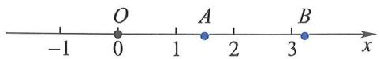

# 实数集与完备性

实数集 $\mathbb{R}$ 是高等数学研究的核心数集，其根本特性在于**完备性**（亦称**连续性**）：  
> **$\mathbb{R}$ 与数轴上的点构成一一对应。**

这一性质是极限、连续、微分与积分等全部分析学理论的逻辑根基。

### 对比：有理数集 $\mathbb{Q}$ 的“不完备性”
- $\mathbb{Q}$ 具有**稠密性**：任意两个不同有理数之间必存在无穷多个有理数（例如 $\frac{r_1 + r_2}{2}$）；
- 但 $\mathbb{Q}$ **不能填满数轴**：存在“空隙”，即无理数点。

图1.1.1直观展示了两个典型无理点：
- 点 $A$：单位正方形对角线长 $\sqrt{2}$（满足 $x^2 - 2 = 0$，无有理根）；
- 点 $B$：单位圆半周长 $\pi$（超越数，非代数数）。

因此，尽管有理点在数轴上处处稠密，却仍存在不可逾越的“洞”。而实数集 $\mathbb{R}$ 正是通过填补所有此类“洞”（即添加所有无理数）而获得完备性。

> 📌 **关键结论**：  
> - 有理数集 $\mathbb{Q}$ 是 $\mathbb{R}$ 的**真子集**，且 $\mathbb{Q}$ 在 $\mathbb{R}$ 中**稠密**（$\overline{\mathbb{Q}} = \mathbb{R}$）；  
> - 但 $\mathbb{Q}$ **不完备**（例如柯西列 $\{3, 3.1, 3.14, 3.141, \dots\}$ 收敛于 $\pi \notin \mathbb{Q}$）；  
> - $\mathbb{R}$ 的完备性等价于**确界存在定理**、**单调有界定理**、**闭区间套定理**等。

深入理解请参阅：[[确界存在定理]]{type=concept, label=完备性的公理表述, render=link, tags=实数|确界}、[[集合相等与空集]]{type=concept, label=集合论预备, render=link, tags=集合论|基础}。

  
图1.1.1：数轴上的有理点（稠密）与无理点（填补空隙）