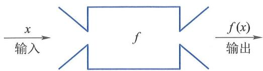

# 映射的定义

设 $A$、$B$ 为非空集合，若对每个 $x \in A$，按照某种确定的法则 $f$，有唯一确定的 $y \in B$ 与之相对应，则称 $f$ 为从 $A$ 到 $B$ 的一个**映射**，记作：

$$
f: A \to B \quad \text{或} \quad f: x \mapsto y = f(x),\quad x \in A.
$$

其中：
- $x$ 称为 **原像**（或逆像），
- $y$ 称为 $x$ 在映射 $f$ 下的 **像**，
- $A$ 称为映射 $f$ 的 **定义域**，记作 $D(f)$ 或 $D_f$，
- $f(A) = \{ y \mid y = f(x),\, x \in A \}$ 称为 $f$ 的 **值域**，记作 $R_f$ 或 $f(A)$。

映射本质上是一种满足**单值性**（每个原像对应唯一像）和**全域性**（$A$ 中每个元素都必须有像）的确定对应关系。它由三要素完全确定：定义域 $A$、陪域 $B$（常隐含在上下文中）、对应法则 $f$。

> 💡 **理解提示**：映射可形象理解为一个“输入–输出”系统（见图1.1.3），输入是原像 $x \in A$，输出是像 $y \in B$。  
>   
> 图1.1.3

该定义是函数概念的抽象推广；当 $A, B \subseteq \mathbb{R}$ 时，映射 $f: A \to B$ 即为通常意义下的**实函数**（初等情形）。

相关知识点：  
- [[集合的定义]]{type=concept, label=集合基础, render=link, subject=高等数学, grade=大学, tags=集合|基础}  
- [[函数的定义]]{type=concept, label=函数特例, render=link, subject=高等数学, grade=大学, tags=函数|映射}  
- [[定义域与值域]]{type=concept, label=核心要素, render=card, tags=映射|定义域|值域}

::: {.note}
映射 $f$ 与表达式 $f(x)$ 含义不同：$f$ 是整体对应规则（一个“机器”），而 $f(x)$ 是该规则作用于具体输入 $x$ 后产生的输出值。
:::