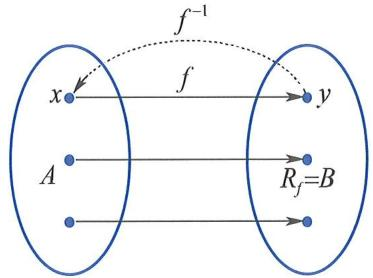

# 逆映射

设 $f: A \to B$ 是一个**一一映射**（即双射），则由定义可知：  
对每个 $y \in B$，存在**唯一**的 $x \in A$，使得 $f(x) = y$。

由此可定义一个新映射：  
$$
f^{-1}: B \to A,\quad f^{-1}(y) = x \quad \text{其中 } f(x) = y.
$$  
该映射称为 $f$ 的 **逆映射**。

- 逆映射 $f^{-1}$ 的**定义域**为 $B$（即原映射的陪域），  
- 其**值域**为 $A$（即原映射的定义域）。

> ✅ **关键性质**：  
> - $f$ 可逆 $\iff$ $f$ 是一一映射；  
> - 若 $f$ 可逆，则 $f^{-1}$ 也可逆，且 $(f^{-1})^{-1} = f$；  
> - 复合恒等：$f^{-1} \circ f = \mathrm{id}_A$，$f \circ f^{-1} = \mathrm{id}_B$（$\mathrm{id}$ 表示恒等映射）。

逆映射是函数中“反函数”概念的抽象源头。当 $A, B \subseteq \mathbb{R}$ 且 $f$ 为严格单调连续函数时，$f^{-1}$ 即为其经典反函数（如 $\exp$ 与 $\ln$、$\sin$ 与 $\arcsin$ 等）。

> 📌 **注意**：仅当映射为双射时，逆映射才良定义；若仅为单射或满射，需限制定义域或陪域后才可能构造逆（如反三角函数的主值支）。

参考图示：  
  
图1.1.4（双射结构是逆映射存在的几何基础）

关联知识：  
- [[映射的性质与分类]]{type=concept, label=双射必要条件, render=link, tags=映射|双射|可逆}  
- [[函数的定义]]{type=concept, label=反函数语境, render=card, subject=高等数学, grade=大学, tags=函数|反函数}  
- [[复合映射]]{type=concept, label=逆的复合验证, render=link, tags=映射|复合|恒等}

::: {.note}
逆映射不是“把公式倒过来解”，而是基于**存在唯一性保证**的结构性重构。其存在性依赖于一一性，而非代数可解性。
:::